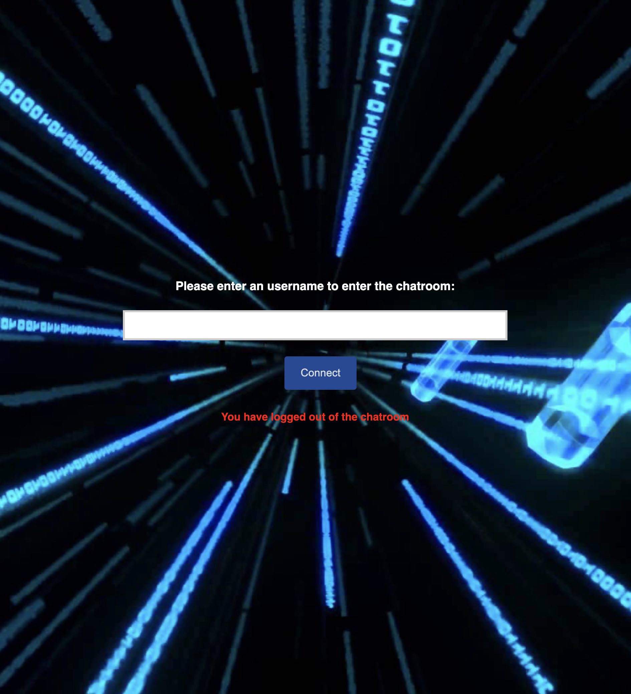

# Chatroom Full Stack Task
This git repo is built for the full stack task of Ubiquiti's full-stack engineer position recruitment process.

The task is to create a chatroom web application that allows multiple users to login/logout and send/receive messages simultaneously.

# Technology Stacks
- Node.js: Framework that is responsible for runtime execution of JavaScript code and applying npm modules.
- ReactJS: Frontend library for building UI components.
- WebSocket​ ​API: a library that opens a two-way interactive communication session between clients and server.

# File Structure
```
client/
    src/
        components/
            Button/
                Button.css
                Button.js
            MessageWindow/
                MessageWindow.css
                MessageWindow.js
            TextBar/
                TextBar.css
                TextBar.js
            TextInput/
                TextInput.css
                TextInput.js
        pages/
            Chatroom/
                Chatroom.css
                Chatroom.js
            Login/
                Login.css
                Login.js
        App.css
        App.js
server/
    index.js
```
# Task Structure 
## System Code/Request Code
System code and request code are used to direct interactions between the server and the clients. The server would send a system code directing the client's action, and the client would send a request code to get the desired information.
### System Code: system to client
- Code 1: Found duplicate code, upon receiving the client's Request Code: 9
- Code 2: Inactive user logs out
- Code 4: Instruct client to close the connection of logged out user

### Request Code: client to server
- Code 0: Request to server with info of user left chatroom, handles clients list
- Code 9: Request for username check for duplication, return System Code 1 if duplicate found; otherwise, handle the new user

## Server/Client
There are two major structure within this task: server-side and client-side

### Server
The server side is mainly responsible for establishing connections to the clients and return system code (e.g. duplicate username error). The server's main function in this task is managing connections with clients and giving direction to clients(using system code). Each successful connection will be stored in a client list as an Object with the format {connection, username, acvitetime}. There are several main functions in the server:

1. Periodically checking lost connections: close lost connection and broadcasts user is left.
2. Periodically checking each client's last active time, and log out the clients that have not been active in a configured timeout from the client-side. System Code: 2
3. Broadcast any client's message to other clients and update the client's active time.
4. Deal with client's request code:
    - Request Code 0: broadcast user left the room
    - Request Code 9: return client the result of duplicate username check and add the client to the clients' list if the client's username is valid
        - Duplicate usernames would trigger the close of the current connection from the client. System Code: 1
5. Upon closing the server: SIGTERM or SIGINT signal received, gracefully close the connection and terminate the server process

### Client
Client-side is mainly responsible for rendering the UX/UI components, and handling the tasks of the user's actions. The client's main function is to display the user interface and dealing with client login/log out, message sending/receiving logic. The chatroom is a React multi-page-feeling in a single-app.

The login page is the page where the client tries to connect to the server once the user entered their username. The login page is also the page that the user gets returned once the connection was lost or the user logged out. A system message would appear if any of the following events would occur:
1. The user logged out of the chatroom. Request Code: 0
2. Disconnected by the server due to inactivity
3. Connection to the server failed

Once a user is logged in and a connection to the server is built, the chatroom page would be displayed. Users can view messages sent from everyone in the chatroom, and chat using keyboard entering text in the text bar at the page bottom. Users can also click disconnect to exit the chatroom. Upon connecting to the server, client-side would do the following:
1. Duplicate username check request to the server. Request Code: 9
2. Connection on error would trigger a disconnect routine.
3. Sending a message to everyone else in the chatroom.
4. Execute client exit due to duplicate usernames. System Code: 1
5. Execute client exit due to inactivity. System Code 2

# UX/UI
## Login page


## Chatroom page


## Login page with system message
